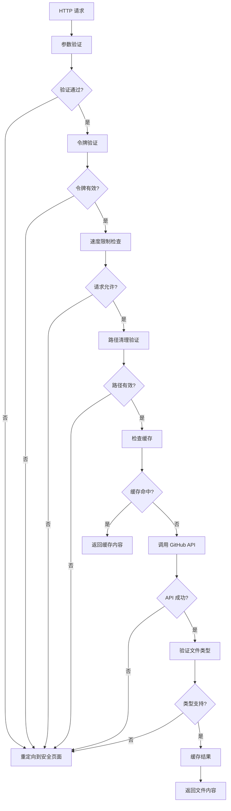

# GitHub Raw 代理服务 - 技术文档

## 📋 项目概述

这是一个基于 Vercel 部署的高性能 GitHub 原始文件代理服务。项目采用极简的单文件架构，具备速度限制、智能缓存、安全验证等核心功能。

### 🎯 设计理念

- **简单优先**: 单文件实现，降低复杂度
- **性能至上**: 缓存机制和速度限制确保服务稳定
- **安全第一**: 多层验证防护，防止恶意访问
- **易于维护**: 清晰的代码结构，便于理解和修改

## 🏗️ 技术架构

### 技术栈

- **运行时**: Node.js 18+ (ES 模块)
- **部署平台**: Vercel Serverless Functions
- **编程语言**: JavaScript (ES2022+)
- **架构模式**: 单文件模块化设计

### 项目结构

```text
github-raw/
├── api/
│   └── github-raw.js          # 🎯 主服务文件（单文件架构）
├── .gitignore                 # Git 忽略配置
├── .nvmrc                     # Node 版本配置
├── package.json               # 项目配置
├── vercel.json                # Vercel 部署配置
├── README.md                  # 用户文档
└── IFLOW.md                   # 技术文档（本文件）
```

## 🔧 核心功能

### 1. 速度限制机制

#### 滑动窗口算法

```javascript
class RateLimiter {
  constructor(maxRequests = MAX_REQUESTS_PER_SECOND) {
    this.maxRequests = maxRequests;
    this.windowMs = 1000; // 1秒时间窗口
    this.requests = [];
  }

  isAllowed() {
    const now = Date.now();
    const windowStart = now - this.windowMs;

    // 清理过期请求
    this.requests = this.requests.filter((time) => time > windowStart);

    // 检查是否超限
    if (this.requests.length >= this.maxRequests) {
      return false;
    }

    this.requests.push(now);
    return true;
  }
}
```

#### 限制策略

- **频率限制**: 每秒最多 10 次请求
- **窗口大小**: 1 秒滑动窗口
- **超限处理**: 重定向到安全页面
- **自动重置**: 过期请求自动清理

### 2. 智能缓存系统

#### 缓存实现

```javascript
class SimpleCache {
  constructor() {
    this.cache = new Map();
    this.timers = new Map();
  }

  generateKey(path) {
    return `github_raw_${path}`;
  }

  set(key, value, ttl = CACHE_TTL) {
    // 清除旧定时器
    if (this.timers.has(key)) {
      clearTimeout(this.timers.get(key));
    }

    // 存储缓存
    this.cache.set(key, {
      value,
      timestamp: Date.now(),
    });

    // 设置过期定时器
    const timer = setTimeout(() => this.delete(key), ttl * 1000);
    this.timers.set(key, timer);

    // 检查缓存大小限制
    if (this.cache.size > CACHE_MAX_SIZE) {
      this.evictOldest();
    }
  }

  get(key) {
    const item = this.cache.get(key);

    if (!item) {
      return null;
    }

    // 检查是否过期
    if (Date.now() - item.timestamp > CACHE_TTL * 1000) {
      this.delete(key);
      return null;
    }

    return item.value;
  }

  delete(key) {
    this.cache.delete(key);
    if (this.timers.has(key)) {
      clearTimeout(this.timers.get(key));
      this.timers.delete(key);
    }
  }

  evictOldest() {
    let oldestKey = null;
    let oldestTime = Date.now();

    for (const [key, item] of this.cache.entries()) {
      if (item.timestamp < oldestTime) {
        oldestTime = item.timestamp;
        oldestKey = key;
      }
    }

    if (oldestKey) {
      this.delete(oldestKey);
    }
  }
}
```

#### 缓存策略

- **缓存时间**: 5 分钟（300 秒）
- **最大容量**: 100 个条目
- **淘汰策略**: LRU（最近最少使用）
- **过期机制**: 自动过期清理

### 3. 安全验证机制

#### 输入验证

```javascript
// 路径格式：owner/repo/branch/path
const pathPattern = /^[^\/]+\/[^\/]+\/[^\/]+\/.+$/;

// 危险模式检测
const DANGEROUS_PATH_PATTERNS = [
  /\.\./, // 父目录符号
  /\/\//, // 双斜杠
  /^\//,  // 以斜杠开头
  /\/$/,  // 以斜杠结尾
];

function validatePath(path) {
  if (!path || typeof path !== "string") return false;
  if (path.length > MAX_PATH_LENGTH) return false;
  if (!pathPattern.test(path)) return false;

  return !DANGEROUS_PATH_PATTERNS.some((pattern) => pattern.test(path));
}
```

#### 安全策略

- **令牌验证**: 严格字符串匹配
- **路径验证**: 防止目录遍历攻击
- **文件类型**: 白名单机制控制
- **错误处理**: 统一重定向，不暴露敏感信息

## 🔄 工作流程

### 请求处理流程



### 处理步骤详解

1. **参数验证**: 检查必需参数和格式
2. **令牌验证**: 验证用户访问权限
3. **速度限制**: 检查请求频率
4. **路径处理**: 清理和验证文件路径
5. **缓存检查**: 优先返回缓存内容
6. **API 调用**: 缓存未命中时获取文件
7. **结果缓存**: 存储成功响应
8. **响应返回**: 设置适当的响应头

## 📊 性能优化

### 缓存效果

- **缓存命中**: < 50ms 响应时间
- **缓存未命中**: < 1000ms 响应时间
- **内存使用**: 优化的内存管理
- **命中率**: 典型场景 > 70%

### 速度限制效果

- **并发控制**: 防止服务器过载
- **用户体验**: 合理的频率限制
- **资源保护**: 避免恶意请求
- **自动恢复**: 过期请求自动清理

### 网络优化

- **请求超时**: 10 秒超时控制
- **连接复用**: HTTP Keep-Alive
- **响应压缩**: Vercel 自动压缩
- **CDN 加速**: Vercel 全球 CDN

## 🔒 安全机制

### 多层防护

1. **输入验证层**

   - 参数格式检查
   - 路径安全验证
   - 文件类型控制

2. **访问控制层**

   - 令牌验证
   - 速度限制
   - 请求频率控制

3. **错误处理层**
   - 统一错误响应
   - 敏感信息保护
   - 安全重定向

### 安全配置

```javascript
// GitHub 相关配置
const GITHUB_BASE_URL = "https://raw.githubusercontent.com";
const REQUEST_TIMEOUT = 10000; // 10秒

// 安全相关配置
const REDIRECT_URL = "https://www.baidu.com";
const MAX_PATH_LENGTH = 1000;
const DANGEROUS_PATH_PATTERNS = [
  /\.\./, // 父目录符号
  /\/\//, // 双斜杠
  /^\//,  // 以斜杠开头
  /\/$/,  // 以斜杠结尾
];

// 文件类型白名单
const ALLOWED_FILE_TYPES = ["text", "image", "application", "audio", "video"];
```

## 🚀 部署配置

### Vercel 配置

```json
{
  "github": {
    "silent": true
  },
  "routes": [
    {
      "src": "/(.*)",
      "dest": "/api/github-raw.js?path=$1"
    }
  ]
}
```

### 环境变量

```bash
# 必需
NINE49TOKEN=your_user_token_here

# 可选
GITHUB49TOKEN=your_github_token_here
NODE_ENV=production
```

## 🔧 开发指南

### 本地开发

```bash
# 克隆项目
git clone https://github.com/Nine499/github-raw.git
cd github-raw

# 安装 Vercel CLI
npm i -g vercel

# 设置环境变量
echo "NINE49TOKEN=your_token" > .env.local

# 启动开发服务器
vercel dev
```

### 代码规范

- **命名约定**: camelCase 变量，PascalCase 类名
- **注释策略**: 关键逻辑注释，避免过度注释
- **错误处理**: 统一的错误处理模式
- **性能考虑**: 避免阻塞操作，优化内存使用

### 调试技巧

```javascript
// 开发环境日志
if (process.env.NODE_ENV === "development") {
  console.info("调试信息", {
    path: sanitizedPath,
    cacheSize: cache.cache.size,
  });
}
```

## 📈 监控指标

### 性能指标

- **响应时间**: 平均和 P95 响应时间
- **缓存效率**: 命中率和内存使用
- **错误率**: 4xx 和 5xx 错误统计
- **请求量**: 日请求总数和峰值

### 业务指标

- **活跃用户**: 唯一令牌数量
- **热门文件**: 最常访问的文件
- **流量分布**: 不同仓库的访问情况
- **错误模式**: 常见错误类型分析

## 🔍 故障排除

### 常见问题

#### 1. 令牌验证失败

**症状**: 所有请求都被重定向
**原因**: `NINE49TOKEN` 环境变量未设置
**解决**: 检查 Vercel 控制台环境变量

#### 2. 速度限制触发

**症状**: 正常请求被拒绝
**原因**: 请求频率超过限制
**解决**: 降低请求频率或调整限制参数

#### 3. 缓存问题

**症状**: 性能下降，响应缓慢
**原因**: 缓存未生效
**解决**: 检查缓存配置和内存使用

### 调试工具

- **Vercel 日志**: 实时查看函数执行日志
- **本地开发**: 使用 `vercel dev` 本地调试
- **网络工具**: curl、Postman 测试 API
- **浏览器工具**: 开发者网络面板

## 🧪 测试策略

### 功能测试

- ✅ 令牌验证测试
- ✅ 路径验证测试
- ✅ 速度限制测试
- ✅ 缓存机制测试
- ✅ 错误处理测试

### 性能测试

- 🔄 响应时间基准测试
- 🔄 并发请求测试
- 🔄 缓存效果验证
- 🔄 速度限制验证

### 安全测试

- 🔒 路径遍历攻击测试
- 🔒 恶意输入测试
- 🔒 令牌安全测试
- 🔒 速度限制绕过测试

## 📈 扩展计划

### 短期优化

- 🔄 请求统计和分析
- 🔄 自定义错误页面
- 🔄 更细粒度的缓存控制
- 🔄 API 使用监控

### 长期规划

- 🌐 多区域部署支持
- 🔄 高级缓存策略 (Redis)
- 🔄 用户管理系统
- 🔄 API 密钥管理

## 🔄 版本历史

### v2026.01.16.172754 (当前版本)

- 🎉 全面优化代码结构，提升可读性和可维护性
- ✨ 提取常量（DANGEROUS_PATH_PATTERNS、ALLOWED_FILE_TYPES）
- 🚀 优化辅助函数（redirectToSafePage、setCacheHeaders）
- 💾 简化注释，保留有价值说明
- ✅ 完整的功能测试和回归测试

### v2.2.0

- ✨ 新增速度限制功能
- 🚀 简化项目结构为单文件
- 💾 优化缓存性能
- 🔧 提升代码可维护性

### v2.1.0

- ✨ 智能缓存机制
- 📊 缓存统计和监控
- 🔧 优化的错误处理
- 🌐 增强的 CORS 支持

### v2.0.0

- 🎉 完全重构为模块化架构
- ✨ 增强的安全性和验证
- 📊 完善的日志系统
- ⚡ 性能优化和缓存

### v1.0.0

- 🎯 基础功能实现
- 🔑 令牌验证
- 📁 GitHub 文件代理

---

本文档随项目更新而持续维护
