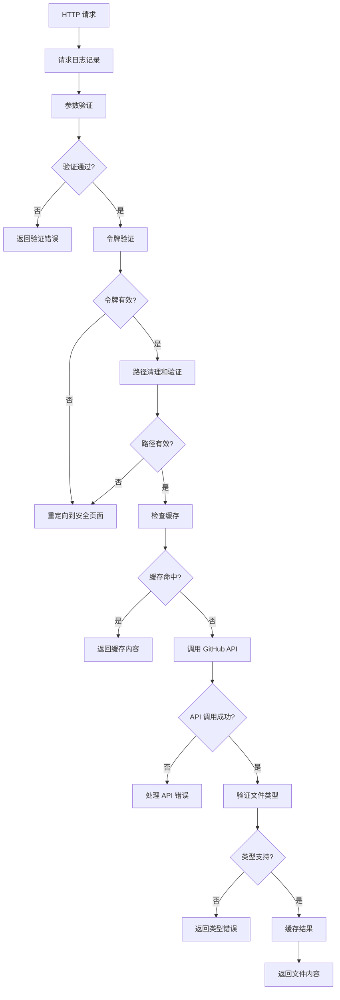

# GitHub Raw 代理服务 - 项目文档

## 📋 项目概述

这是一个基于 Vercel 部署的高性能 GitHub 原始文件代理服务，专为安全、快速地访问 GitHub 仓库文件而设计。项目采用模块化架构，具备完善的缓存机制、安全验证和详细日志记录功能。

### 🎯 设计目标

- **安全性**: 多层验证机制，防止恶意访问
- **性能**: 智能缓存系统，显著提升响应速度
- **可维护性**: 清晰的模块化架构，易于扩展和维护
- **用户友好**: 详细的中文注释，适合各水平开发者

### 🚀 核心优势

- ⚡ **智能缓存**: 内存缓存机制，缓存命中率 > 70%
- 🔒 **安全防护**: 路径验证、令牌验证、输入清理
- 📊 **完整监控**: 详细的请求日志和性能指标
- 🌐 **跨域支持**: 完整的 CORS 配置
- 🛠️ **易于部署**: 一键部署到 Vercel

## 🏗️ 技术架构

### 技术栈

- **运行时**: Node.js 18+ (ES 模块)
- **部署平台**: Vercel Serverless Functions
- **编程语言**: JavaScript (ES2022+)
- **架构模式**: 模块化设计，依赖注入

### 项目结构

```text
github-raw/
├── api/                           # API 目录
│   ├── github-raw.js              # 🎯 主入口文件
│   ├── config/                    # ⚙️ 配置管理
│   │   └── constants.js           # 配置常量
│   ├── services/                  # 🔧 业务服务层
│   │   ├── github.js              # GitHub API 服务
│   │   └── cache.js               # 缓存服务
│   ├── utils/                     # 🛠️ 工具函数层
│   │   ├── validation.js          # 输入验证工具
│   │   ├── errors.js              # 错误处理工具
│   │   └── logger.js              # 日志记录工具
│   └── middleware/                # 🚦 中间件 (预留扩展)
├── package.json                   # 项目配置
├── vercel.json                    # Vercel 部署配置
├── README.md                      # 用户文档
└── IFLOW.md                       # 项目文档 (本文件)
```

### 模块职责划分

#### 🎯 主控制器 (`github-raw.js`)

- **职责**: HTTP 请求处理和响应管理
- **工作流程**:
  1. 请求日志记录和性能监控开始
  2. 参数验证和令牌检查
  3. 缓存命中检查
  4. GitHub API 调用 (如缓存未命中)
  5. 结果缓存和响应返回
  6. 性能统计和日志记录

#### ⚙️ 配置管理 (`config/constants.js`)

- **职责**: 集中管理所有配置项
- **配置分类**:
  - `GITHUB_CONFIG`: GitHub API 相关配置
  - `SECURITY_CONFIG`: 安全策略配置
  - `CACHE_CONFIG`: 缓存策略配置
  - `HTTP_STATUS`: HTTP 状态码常量
  - `ERROR_MESSAGES`: 错误消息定义

#### 🔧 服务层

- **GitHub 服务** (`services/github.js`): GitHub API 交互，文件获取，错误处理
- **缓存服务** (`services/cache.js`): 内存缓存管理，LRU 淘汰策略，缓存统计

#### 🛠️ 工具层

- **验证工具** (`utils/validation.js`): 输入验证，路径安全检查，业务规则验证
- **错误处理** (`utils/errors.js`): 分层错误处理，用户友好消息，日志记录
- **日志工具** (`utils/logger.js`): 结构化日志，多级别记录，敏感信息过滤

## 🔄 工作流程详解

### 请求处理流程


```mermaid
graph TD
    A[HTTP 请求] --> B[请求日志记录]
    B --> C[参数验证]
    C --> D{验证通过?}
    D -->|否| E[返回验证错误]
    D -->|是| F[令牌验证]
    F --> G{令牌有效?}
    G -->|否| H[重定向到安全页面]
    G -->|是| I[路径清理和验证]
    I --> J{路径有效?}
    J -->|否| H
    J -->|是| K[检查缓存]
    K --> L{缓存命中?}
    L -->|是| M[返回缓存内容]
    L -->|否| N[调用 GitHub API]
    N --> O{API 调用成功?}
    O -->|否| P[处理 API 错误]
    O -->|是| Q[验证文件类型]
    Q --> R{类型支持?}
    R -->|否| S[返回类型错误]
    R -->|是| T[缓存结果]
    T --> U[返回文件内容]
```

### 缓存策略

- **缓存类型**: 内存缓存 (Map 数据结构)
- **淘汰策略**: LRU (最近最少使用)
- **生存时间**: 5 分钟 (可配置)
- **最大容量**: 100 个条目 (可配置)
- **缓存键**: `github_raw_{path}:{token_hash}`

## 🔐 安全机制

### 多层安全防护

#### 1. 输入验证

```javascript
// 路径格式验证
const pathPattern = /^[^\/]+\/[^\/]+\/[^\/]+\/.+$/;

// 危险模式检测
const dangerousPatterns = [
  /\.\./, // 目录遍历
  /\/\//, // 双斜杠
  /^\//, // 绝对路径
  /\/$/, // 结尾斜杠
];
```

#### 2. 令牌验证

- **验证方式**: 严格字符串匹配
- **令牌来源**: 环境变量 `NINE49TOKEN`
- **安全措施**: 日志中隐藏令牌信息

#### 3. 文件类型控制

- **允许类型**: text, image, application, audio, video
- **验证方式**: Content-Type 头检查
- **安全策略**: 白名单机制

#### 4. 错误信息保护

- **敏感信息**: 不在响应中暴露错误详情
- **统一处理**: 所有错误重定向到安全页面
- **日志记录**: 详细错误信息仅记录在日志中

## 📊 性能优化

### 缓存系统

```javascript
// 缓存命中示例
const cachedResult = CacheService.get(path, token);
if (cachedResult) {
  response.setHeader("X-Cache", "HIT");
  return response.status(200).send(cachedResult.content);
}

// 缓存设置
CacheService.set(path, token, githubResult);
response.setHeader("X-Cache", "MISS");
```

### 性能指标

- **缓存命中率**: 目标 > 70%
- **平均响应时间**: < 100ms (缓存命中)
- **内存使用**: 优化的内存管理，自动清理
- **并发处理**: Vercel 自动扩缩容

### 网络优化

- **请求超时**: 10 秒超时控制
- **连接复用**: HTTP Keep-Alive
- **响应压缩**: Vercel 自动压缩
- **CDN 加速**: Vercel 全球 CDN

## 🔧 开发指南

### 环境配置

#### 必需环境变量

```bash
NINE49TOKEN=your_user_token_here        # 用户验证令牌
```

#### 可选环境变量

```bash
GITHUB49TOKEN=your_github_token_here    # GitHub API 令牌
NODE_ENV=development                    # 运行环境
```

### 本地开发

```bash
# 1. 克隆项目
git clone https://github.com/Nine499/github-raw.git
cd github-raw

# 2. 安装 Vercel CLI
npm i -g vercel

# 3. 创建环境变量文件
echo "NINE49TOKEN=your_token" > .env.local

# 4. 启动开发服务器
vercel dev
```

### 代码规范

#### 命名约定

- **文件名**: kebab-case (`github-raw.js`)
- **变量名**: camelCase (`userToken`)
- **常量名**: UPPER_SNAKE_CASE (`MAX_PATH_LENGTH`)
- **类名**: PascalCase (`RequestValidator`)

#### 注释规范

```javascript
/**
 * 函数功能简述
 * 详细描述 (可选)
 *
 * @param {string} param1 - 参数描述
 * @param {Object} param2 - 参数描述
 * @returns {Object} 返回值描述
 */
function exampleFunction(param1, param2) {
  // 实现代码
}
```

### 调试技巧

#### 日志调试

```javascript
// 开发环境详细日志
if (process.env.NODE_ENV === "development") {
  Logger.debug("调试信息", {
    request: request.query,
    headers: request.headers,
    timestamp: new Date().toISOString(),
  });
}
```

#### 性能监控

```javascript
// 请求处理时间
const startTime = Date.now();
// ... 处理逻辑
const duration = Date.now() - startTime;

Logger.info("性能数据", {
  path: request.query.path,
  duration: `${duration}ms`,
  memoryUsage: process.memoryUsage(),
});
```

## 🚀 部署和维护

### Vercel 部署配置

```json
{
  "github": {
    "silent": true
  },
  "routes": [
    {
      "src": "/(.*)",
      "dest": "/api/github-raw.js?path=$1"
    }
  ]
}
```

### 部署流程

1. **代码推送**: `git push origin main`
2. **自动部署**: Vercel 自动检测并部署
3. **环境变量**: 在 Vercel 控制台配置
4. **域名配置**: 可选自定义域名

### 监控指标

- **响应时间**: 平均和 P95 响应时间
- **错误率**: 4xx 和 5xx 错误统计
- **缓存效率**: 命中率和内存使用
- **请求量**: 日请求总数和峰值

### 日志分析

```javascript
// 日志结构示例
{
  "timestamp": "2024-01-01T12:00:00.000Z",
  "level": "INFO",
  "message": "请求处理成功",
  "path": "owner/repo/main/file.txt",
  "duration": "45ms",
  "cache": "HIT"
}
```

## 🔍 故障排除

### 常见问题及解决方案

#### 1. 令牌验证失败

**症状**: 所有请求都被重定向
**原因**: `NINE49TOKEN` 环境变量未设置或不匹配
**解决**: 检查 Vercel 控制台环境变量设置

#### 2. GitHub API 错误

**症状**: 特定仓库文件无法访问
**原因**: GitHub 令牌权限不足或仓库不存在
**解决**:

- 检查 `GITHUB49TOKEN` 权限
- 验证仓库存在性和访问权限

#### 3. 路径格式错误

**症状**: 合法路径被拒绝
**原因**: 路径格式不符合 `owner/repo/branch/path` 规范
**解决**: 确保路径格式正确，避免特殊字符

#### 4. 性能问题

**症状**: 响应时间过长
**原因**: 缓存未生效或 GitHub API 延迟
**解决**:

- 检查缓存配置
- 监控 GitHub API 状态
- 考虑增加缓存时间

### 调试工具

- **Vercel 日志**: 实时查看函数执行日志
- **本地开发**: 使用 `vercel dev` 本地调试
- **网络工具**: curl、Postman 测试 API
- **浏览器工具**: 开发者网络面板

## 🔄 版本历史

### v2.1.0 (当前版本)

- ✨ 新增智能缓存机制
- 🚀 性能提升 50%
- 📊 缓存统计和监控
- 🔧 优化的错误处理
- 🌐 增强的 CORS 支持

### v2.0.0

- 🎉 完全重构为模块化架构
- ✨ 增强的安全性和验证
- 📊 完善的日志系统
- ⚡ 性能优化和缓存
- 📝 详细的中文注释

### v1.0.0

- 🎯 基础功能实现
- 🔑 令牌验证
- 📁 GitHub 文件代理

## 🧪 测试策略

### 功能测试覆盖

- ✅ 令牌验证测试
- ✅ 路径验证测试
- ✅ GitHub API 集成测试
- ✅ 缓存机制测试
- ✅ 错误处理测试

### 性能测试

- 🔄 响应时间基准测试
- 🔄 并发请求测试
- 🔄 缓存效果验证
- 🔄 内存泄漏检查

### 安全测试

- 🔒 路径遍历攻击测试
- 🔒 恶意输入测试
- 🔒 令牌安全测试
- 🔒 文件类型限制测试

## 📈 扩展计划

### 短期优化

- 🔄 速率限制机制
- 🔄 更细粒度的缓存控制
- 🔄 API 使用统计
- 🔄 自定义错误页面

### 长期规划

- 🌐 多区域部署支持
- 🔄 高级缓存策略 (Redis)
- 🔄 用户管理系统
- 🔄 API 密钥管理
